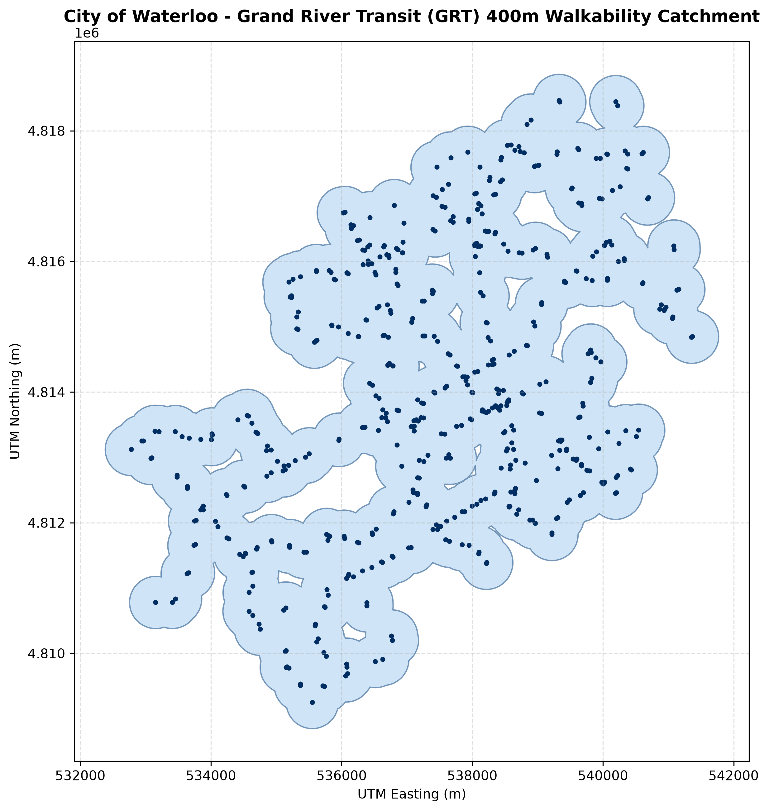

# Geospatial Analysis & Geomatics Portfolio

A collection of spatial data pipelines, catchment modeling, and thematic cartographic exhibits built with Python (`GeoPandas`, `Matplotlib`) and Desktop GIS (`ArcGIS Pro`, `QGIS`).

---

## 1. Transit Walkability & Catchment Analysis Pipeline (Python)
* **Directory:** [`/transit-accessibility-python`](./transit-accessibility-python)
* **Technologies:** Python, GeoPandas, Matplotlib, UTM Projection (EPSG:26917)
* **Overview:** 
  * Parsed municipal open data containing 2,500+ Grand River Transit (GRT) stop coordinates across Waterloo Region.
  * Reprojected spatial coordinates from WGS84 geographic coordinates to NAD83 / UTM Zone 17N to perform accurate metric distance calculations.
  * Generated 400-meter walkability buffers (standard 5-minute walking catchment), dissolved overlapping boundaries, and computed total square kilometer service area.
  * Automated high-resolution map image generation via Matplotlib.

---

## 2. County-Level Voting Patterns & Margin Shifts Analysis (GIS)
* **Directory:** [`/michigan-election-gis`](./michigan-election-gis)
* **Technologies:** ArcGIS Pro, QGIS, Cartographic Layout Design
* **Overview:**
  * Joined tabular historical election dataset records from the MIT Election Data + Science Lab with U.S. Census TIGER/Line county shapefiles.
  * Calculated county-level margin changes between 2020 and 2024 to analyze regional political shifts and urban-rural divides.
  * Designed a multi-map print layout incorporating choropleth symbology, state locator insets, and standardized visual hierarchy.

